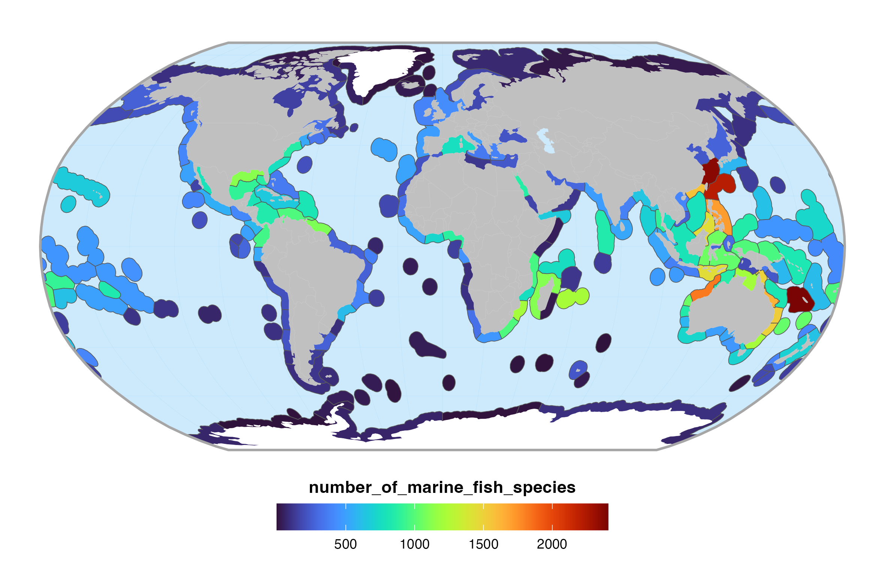

<!-- README.md is generated from README.Rmd. Please edit that file -->


```{r, include = FALSE}
knitr::opts_chunk$set(collapse  = TRUE,
                      comment   = "#>",
                      fig.path  = "man/figures/",
                      out.width = "100%")
```


# World fish occurrences at ecoregion level 


<!-- badges: start -->
[](https://choosealicense.com/licenses/mit/)
<!-- badges: end -->


<p align="left">
  • <a href="#overview">Overview</a><br>
  • <a href="#data-sources">Data sources</a><br>
  • <a href="#workflow">Workflow</a><br>
  • <a href="#content">Content</a><br>
  • <a href="#installation">Installation</a><br>
  • <a href="#usage">Usage</a><br>
  • <a href="#citation">Citation</a><br>
  • <a href="#contributing">Contributing</a><br>
  • <a href="#acknowledgments">Acknowledgments</a><br>
  • <a href="#references">References</a>
</p>


## Overview

This project is dedicated to retrieve, clean and check GBIF occurrences for all fish species of the World (n = 35,035 species). Occurrences are aggregated at the ecoregion level (Spalding _et al._, 2007) for marine species and at the drainage basin level (Tedesco _et al._, 2017) for freshwater species.




## Data sources

This project uses the following databases:

| Database        | Usage                                        | Reference                 | Link   |
| :-------------- | :------------------------------------------- | :------------------------ | :----: |
| Fishbase        | Get fish species accepted names              | Froese R & Pauly D (2000) | [link](https://www.fishbase.se/) |
| GBIF            | Get fish occurrences at World scale          | GBIF.org (2024)           | [link](https://www.gbif.org/)    |
| MEOW            | Aggregate occurrences for marine species     | Spalding _et al._ (2007)  | [link](https://www.worldwildlife.org/publications/marine-ecoregions-of-the-world-a-bioregionalization-of-coastal-and-shelf-areas) |
| Drainage basins | Aggregate occurrences for freshwater species | Tedesco _et al._ (2017)   | [link](https://figshare.com/collections/A_global_database_on_freshwater_fish_species_occurrences_in_drainage_basins/3739145) |

A comprehensive description of all these databases is available [here](https://github.com/phenofish/gbif-ecoregions/blob/main/data/README.md).


## Workflow

The analysis pipeline follows these steps:

1. Find GBIF accepted names & identifiers from Fishbase accepted names
2. Download GBIF occurrences
3. Clean and check GBIF occurrences
4. Intersect occurrences w/ marine ecoregions layer (marine species)
5. Intersect occurrences w/ drainage basins layer (terrestrial species)
6. Export layers in [`outputs/`](https://github.com/phenofish/gbif-ecoregions/blob/main/outputs)
7. Compute marine and freshwater species richness
8. Export barplots and maps in [`figures/`](https://github.com/phenofish/gbif-ecoregions/blob/main/figures)


## Content

This repository is structured as follow:

- [`DESCRIPTION`](https://github.com/phenofish/gbif-ecoregions/blob/main/DESCRIPTION): contains project metadata (authors, description, license, dependencies, etc.).

- [`make.R`](https://github.com/phenofish/gbif-ecoregions/blob/main/make.R): main R script to set up and run the entire project. Open this file to follow the workflow step by step.

- [`R/`](https://github.com/phenofish/gbif-ecoregions/blob/main/R): contains R functions developed especially for this project.

- [`data/`](https://github.com/phenofish/gbif-ecoregions/blob/main/data): contains raw data used in this project. See the [`README`](https://github.com/phenofish/gbif-ecoregions/blob/main/data/README.md) for further information.

- [`analyses/`](https://github.com/phenofish/gbif-ecoregions/blob/main/analyses): contains R scripts to run the workflow. The order to run these scripts is explained in the [`make.R`](https://github.com/phenofish/gbif-ecoregions/blob/main/make.R) and the description of each script is available in the header of each file.

- [`outputs/`](https://github.com/phenofish/gbif-ecoregions/blob/main/outputs): contains the outputs of the project. See the [`README`](https://github.com/phenofish/gbif-ecoregions/blob/main/outputs/README.md) for a complete description of the files.

- [`figures/`](https://github.com/phenofish/gbif-ecoregions/blob/main/figures): contains the figures used to validate et visualize the outputs. See the [`README`](https://github.com/phenofish/gbif-ecoregions/blob/main/figures/README.md) for a complete description of the figures.


## Installation

To install this compendium:

- [Fork](https://docs.github.com/en/get-started/quickstart/contributing-to-projects) 
this repository using the GitHub interface.
- [Clone](https://docs.github.com/en/repositories/creating-and-managing-repositories/cloning-a-repository) 
your fork using `git clone fork-url` (replace `fork-url` by the URL of your fork). 
Alternatively, open [RStudio IDE](https://posit.co/products/open-source/rstudio/) 
and create a New Project from Version Control.


## Usage

Launch the [`make.R`](https://github.com/phenofish/gbif-ecoregions/blob/main/make.R)
file with:

```{r eval=FALSE}
source("make.R")
```

**Notes**

- All required packages listed in the [`DESCRIPTION`](https://github.com/phenofish/gbif-ecoregions/blob/main/DESCRIPTION) file will be installed (if necessary)
- All required packages and R functions will be loaded
- Each script in [`analyses/`](https://github.com/phenofish/gbif-ecoregions/blob/main/analyses) can be run independently
- Some steps listed in the [`make.R`](https://github.com/phenofish/gbif-ecoregions/blob/main/make.R) might take time (days and days)


## Citation

Please use the following citation: 

> Casajus N & Loiseau N (2024) A database on World fish species occurrences at ecoregion and drainage basin level. URL: <https://github.com/phenofish/gbif-ecoregions/>.


## Contributing

All types of contributions are encouraged and valued. For more information, 
check out our [Contributor Guidelines](https://github.com/phenofish/gbif-ecoregions/blob/main/CONTRIBUTING.md).

Please note that this project is released with a 
[Contributor Code of Conduct](https://contributor-covenant.org/version/2/1/CODE_OF_CONDUCT.html). 
By contributing to this project, you agree to abide by its terms.


## Acknowledgments

This project has been developed for the 
[FRB-CESAB](https://www.fondationbiodiversite.fr/en/about-the-foundation/le-cesab/) 
research group 
[Phenofish](https://www.fondationbiodiversite.fr/en/the-frb-in-action/programs-and-projects/le-cesab/phenofish/) 
that aims to create a global database of fish functional traits integrating 
physiology and ecology across World aquatic ecosystems.


## References

Froese R & Pauly D (2000) FishBase 2000: Concepts, designs and data sources. ICLARM, Los Banos, Philippines. URL: <https://www.fishbase.se/>.

GBIF.org (2024) GBIF Home Page. Available from: <https://www.gbif.org> [17 February 2024].

Spalding MD _et al._ (2007) Marine Ecoregions of the World: A Bioregionalization of Coastal and Shelf Areas. **BioScience**, 57(7), 573-583. DOI: <https://doi.org/10.1641/B570707>.

Tedesco P _et al._ (2017) A global database on freshwater fish species occurrence in drainage basins. **Scientific Data**, 4, 170141. DOI: <https://doi.org/10.1038/sdata.2017.141>.
